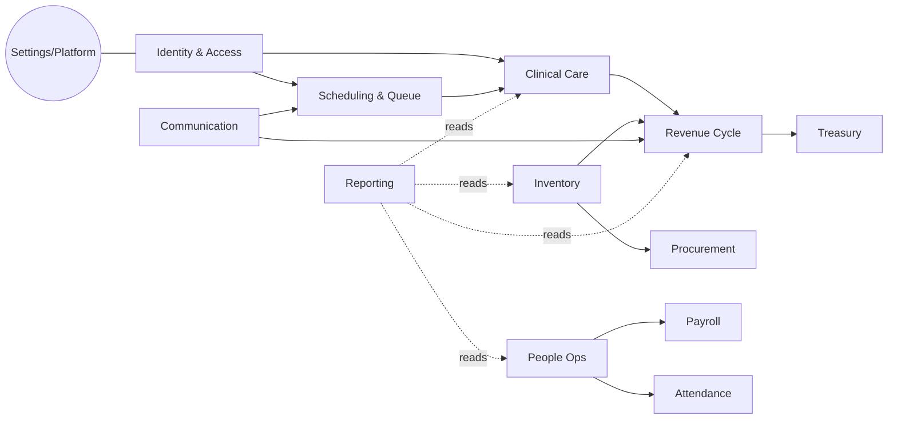

# 04 — Domain Model

Derived from `docs/architecture/DOMAIN_DRIVEN_DESIGN_REVIEW.md` and the live schema. See `15_ENTITY_CATALOG.md` for per-aggregate details.

## Bounded contexts

## Aggregates (roots)
| Context | Aggregate root | Notes |
|---|---|---|
| Identity | `auth.users` + `profiles` + `user_roles` | Roles never live on `profiles`. |
| Authorization | `authz_bundles` + `authz_permissions` (+ implies/role_bundles) | Read via `v_authz_effective_permissions`. |
| Scheduling | `appointments` | Configured by `appointment_settings`. |
| Queue | `queue_settings` + `queue_alerts` | |
| Patient | `patients` (+ `patient_documents`, `patient_wallets`) | PHI. |
| Clinical | `medical_records` (+ `record_diagnoses`, `record_procedures`, `vital_signs`) | Encounter aggregate implicit. |
| Prescriptions | `prescriptions` (+ `prescription_items`) | |
| Dental | `dental_chart` | |
| Physio | `physio_cases` (+ `physio_sessions`, `physio_reassessments`) | |
| Treatment plans | `treatment_plans` (+ `treatment_sessions`) | |
| Invoicing | `invoices` (+ `invoice_items`) | Counter: `invoice_counters`. |
| Payments | `payments` | Refund via same aggregate + `payments.refund`. |
| Treasury | `treasury` (+ `treasury_transactions`, `treasury_daily_closes`) | |
| Wallet | `patient_wallets` (+ `patient_wallet_transactions`) | |
| Coupons | `coupons` (+ `coupon_redemptions`) | |
| Insurance | `insurance_companies` (+ `contracts`, `contract_rules`) | |
| Inventory | `inventory` (+ `inventory_transactions`, `stock_alerts`) | |
| Products | `products` (+ `product_categories`) | |
| Procurement | `purchase_orders` (+ `purchase_order_items`, `suppliers`) | |
| Services | `services` (+ `service_categories`, `service_consumables`) | |
| HR | `staff_profiles` (+ `staff_positions`, `staff_branches`, `departments`) | |
| Leave | `leave_requests` (+ `leave_types`) | |
| Payroll | `payroll` (+ `salary_adjustments`, `doctor_commissions`, `staff_targets`) | |
| Attendance | `attendance` (+ `work_schedules`) | |
| Comms | `communication_templates`, `email/sms/whatsapp_templates`, `reminders` | |
| SaaS billing | `subscriptions`, `subscription_plans`, `tenants`, `saas_invoices`, `saas_payments` | |

## Ubiquitous language (excerpt)
- **Encounter**: currently modeled inside `medical_records`. **Assumption**: a separate `encounters` aggregate is a future extraction.
- **Case**: physio-specific longitudinal engagement (`physio_cases`).
- **Bundle**: named group of permissions assigned to roles.
- **Branch**: physical location within a tenant.
- **Tenant**: logical clinic organization (SaaS billing unit).
