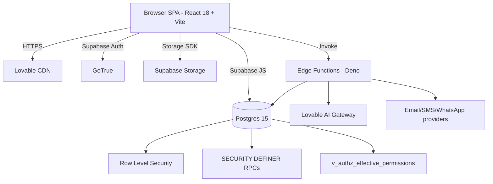

# 05 — System Architecture

## High level

## Runtime layers
1. **Presentation** — React 18, React Router 6, TanStack Query, shadcn/ui, Tailwind v3.
2. **State** — TanStack Query cache + React context (`AuthContext`, `BranchContext`, `I18nContext`).
3. **Authorization** — `AuthorizationService` + `usePermissions`; canonical rows from `v_authz_effective_permissions`, legacy fallback from `role_permissions`. Feature-flagged.
4. **Data** — Supabase JS client → Postgres via PostgREST. RLS on every public table.
5. **Server logic** — SECURITY DEFINER SQL functions + Deno Edge Functions for privileged operations (admin user CRUD, exports, reminders, queue alerts).
6. **Observability** — Sentry (`src/lib/observability/sentry.ts`), correlation IDs, telemetry probes.

## Deployment
- Hosted by Lovable; single origin. Domains: `belalaamer.com`, `www.belalaamer.com`, `practice-pulse-plus.lovable.app`.
- Supabase project is Lovable-managed (dashboard access not exposed).
- CI: GitHub Actions (`codeql.yml`, `shadow-qa.yml`).

## Non-functional posture
| Aspect | Status |
|---|---|
| Availability | Single-region Supabase; **Assumption**: 99.9% target. |
| Backups | `system_backups` table + Supabase PITR. |
| Auditing | `audit_logs`, `user_activity_logs`. |
| Security scanning | CodeQL + shadow authorization probes. |
| Performance | Pagination audited (`docs/sprint4/PAGINATION_AUDIT.md`). |
