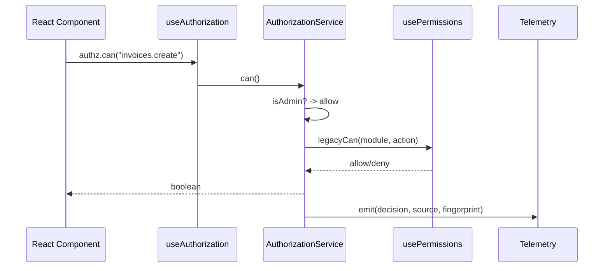

# 07 — Authorization Architecture

Canonical, bundle-based RBAC. Runtime is production-ready and behind a feature flag with legacy fallback. **Do not modify runtime; documentation only.**

## Pieces
| Piece | Location |
|---|---|
| Permission catalog | `authz_permissions` (rows) + `docs/PERMISSION_CATALOG.md` |
| Bundle registry | `authz_bundles`, `authz_bundle_permissions`, `authz_bundle_implies`, `authz_role_bundles` |
| Effective view | `v_authz_effective_permissions` (user_id → permission_key) |
| Legacy grant map | `role_permissions` (kept for fallback) |
| Roles table | `user_roles` (enum `app_role`) |
| Role check fn | `public.has_role(_user_id uuid, _role app_role)` — SECURITY DEFINER |
| Frontend service | `src/lib/authz/AuthorizationService.ts` |
| Frontend hook | `src/lib/authz/useAuthorization.ts` + `src/hooks/usePermissions.ts` |
| Canonical reader | `src/lib/authz/canonicalPermissions.ts` |
| Feature flag | `src/lib/authz/featureFlags.ts` |
| Telemetry / shadow | `src/lib/authz/telemetry.ts`, shadow tables `authz_shadow_*` |
| Guards | `<Can>`, `<CanExport>`, `<PermissionRoute>`, `<ProtectedRoute>` |

## Decision flow



## Naming standard
```
<group>.<verb>[.<qualifier>]
```
Groups & verbs: see `docs/normalization/N1_PERMISSION_TAXONOMY_V2.md`.

## Phase status
- **Phase A** — bundles authored ✅
- **Phase B** — canonical runtime validated ✅
- **Phase C** — legacy retirement **blocked** until 30-day observation completes

## Rules for AI/engineers
1. Never bypass `AuthorizationService`.
2. Never store roles anywhere except `user_roles`.
3. Never introduce raw `role === "admin"` checks in components.
4. New permissions require governance ticket + catalog update.
5. Admin bypass is intentional; do not remove.
