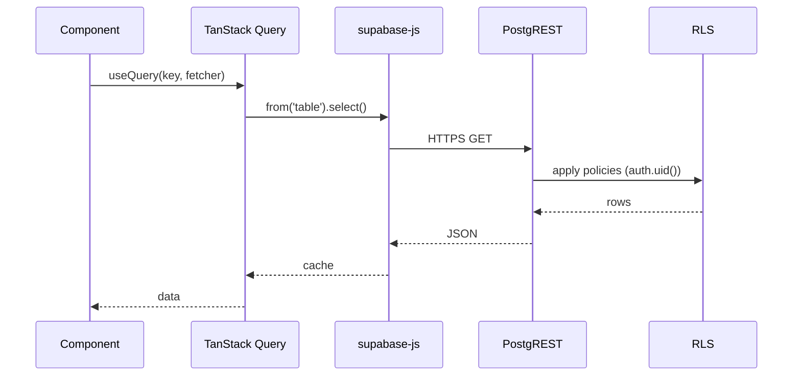

# 16 — Data Flow

## Read path



## Write path
Same, mutating verbs go through `supabase.from(...).insert/update/delete` or a SECURITY DEFINER RPC (`supabase.rpc('fn', args)`), always subject to RLS + policy checks.

## Privileged path
```
Component --> Edge Function --> service role (server) --> Postgres
```
Only for admin user CRUD, bulk export, reminders. Never callable from public routes without JWT.

## Realtime
`src/lib/realtime.ts` opens channels for queue, appointments, notifications. Cache invalidation via TanStack Query.
