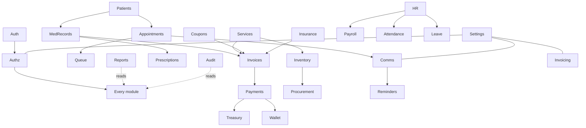

# 27 — Dependency Graph (Modules)

```mermaid
graph TD
  Auth --> Authz
  Authz --> All[Every module]
  Patients --> MedRecords
  Patients --> Appointments
  Appointments --> Queue
  Appointments --> Comms
  MedRecords --> Prescriptions
  MedRecords --> Invoices
  Services --> Invoices
  Services --> Inventory
  Invoices --> Payments
  Payments --> Treasury
  Payments --> Wallet
  Coupons --> Invoices
  Insurance --> Invoices
  Inventory --> Procurement
  HR --> Payroll
  HR --> Attendance
  HR --> Leave
  Comms --> Reminders
  Reports -.reads.-> All
  Audit -.reads.-> All
  Settings --- Authz
  Settings --- Comms
  Settings --- Invoicing
```

Cross-module boundaries are one-way where possible; Reporting and Audit are read-only consumers.
