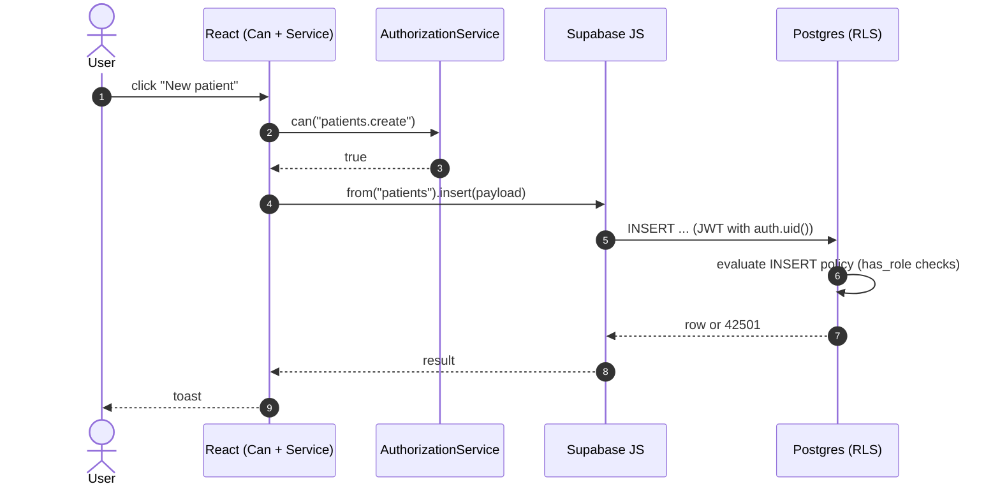
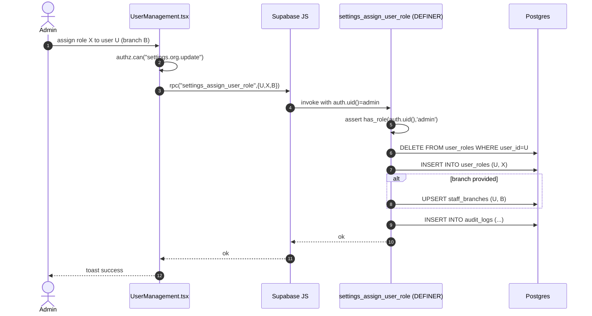
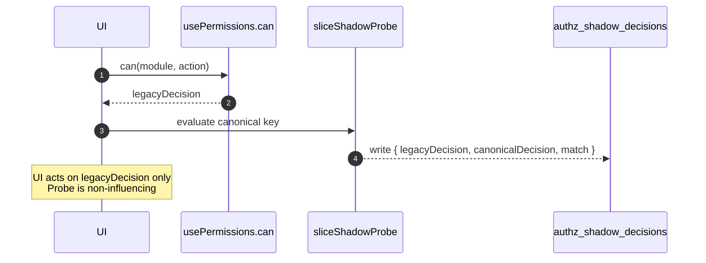

# Authorization Architecture

**Status:** Current (post Migration 2 — Settings, Patients, Medical Records, HR, Invoices/Finance slices `complete`)
**Last updated:** 2026-07-11
**Owners:** Platform / Authorization working group
**Scope:** Application-level authorization for the Clinic Management System (frontend React app + Lovable Cloud / Postgres backend).

This document is the single source of truth for how authorization works today. It supersedes the historical Wave 1–3 notes under `docs/wave*/` and the RC1/RC2 governance drafts, which are retained for provenance only.

---

## 1. High-level architecture

Authorization is enforced at **three independent layers**. A request must pass every layer that applies to it. No layer trusts another.

```
┌─────────────────────────────────────────────────────────────────────┐
│ 1. UI GATING (advisory)                                             │
│    <Can permission="..."> / useAuthorization().authz.can(...)       │
│    Purpose: hide affordances the user cannot use. Never a security   │
│    boundary. A hostile client can bypass it.                         │
├─────────────────────────────────────────────────────────────────────┤
│ 2. ROUTE GATING (advisory)                                          │
│    <PermissionRoute module="..."> in src/App.tsx                    │
│    Purpose: block navigation into pages a role cannot use.          │
├─────────────────────────────────────────────────────────────────────┤
│ 3. DATA-PLANE ENFORCEMENT (authoritative)                           │
│    a. Postgres Row-Level Security on every public table             │
│    b. SECURITY DEFINER RPCs for the small set of multi-table /      │
│       privilege-escalation-sensitive writes                          │
│    Purpose: the actual security boundary. Enforced by the DB even   │
│    if the client is malicious or the UI has bugs.                    │
└─────────────────────────────────────────────────────────────────────┘
```

Key principles:

- **RLS is the default.** Every public-schema table has RLS enabled and at least one policy. UI checks are cosmetic.
- **SECURITY DEFINER is the exception.** Used only when a write must span tables atomically, or when it grants privilege (role assignment). Every DEFINER function is admin-gated, audit-logged, and enumerated in this document.
- **One canonical service in the frontend.** All UI/route checks flow through `AuthorizationService` (`src/lib/authz/AuthorizationService.ts`). No component checks role strings directly.
- **Slice-scoped invariants.** Once a vertical slice migrates to the canonical model, a CI-enforced invariant (`completedSlices.invariant.test.ts`) makes legacy regressions a build failure.

---

## 2. Authorization flow

### 2.1 Sign-in and identity hydration

1. User authenticates via Supabase Auth (email/password or OAuth).
2. `AuthContext` (`src/contexts/AuthContext.tsx`) hydrates the session and exposes `user`, `session`.
3. `useUserRole` reads the user's rows from `public.user_roles` (auth-only table, read via RLS by the user themselves).
4. `usePermissions` loads the effective grant map for the user's role(s) from `public.role_permissions` (falling back to `DEFAULT_PERMISSIONS` in `src/lib/rolePermissions.ts` for baseline behavior).
5. `useAuthorization()` composes those into a memoized `AuthorizationService` instance carrying `{ can, isAdmin, roles, fingerprint, telemetry emit }`.

### 2.2 A UI-gated action

```
User clicks "New patient"
 → <Can permission="patients.create"> checks authz.can("patients.create")
 → allowed → button rendered → click → supabase.from("patients").insert(...)
 → Postgres evaluates RLS on public.patients (INSERT policy)
 → RLS allows or rejects
```

If step 1 is bypassed (curl, DevTools, malicious SPA), step 4 still holds.

### 2.3 A DEFINER-gated action (Settings user role assignment)

```
Admin in Settings > User Management assigns a role
 → UI check: authz.can("settings.org.update")
 → supabase.rpc("settings_assign_user_role", { _target_user_id, _new_role, _branch_id })
 → DEFINER function re-checks caller is admin (has_role(auth.uid(),'admin'))
 → clears prior role rows, inserts new role, optionally links branch, writes audit_logs entry
 → returns success or raises exception → UI toasts result
```

---

## 3. Permission model

### 3.1 Keys

Canonical permission keys are dotted strings: `<module>.<action>`.

- `module` — a coarse capability area (e.g. `patients`, `invoices`, `settings`, `reports_finance`). Enumerated in `MODULES` in `src/lib/rolePermissions.ts`.
- `action` — one of `view | create | edit | delete | export` (`ACTIONS`).

The full catalogue lives in `docs/PERMISSION_CATALOG.md`. Newer, fully-qualified keys such as `settings.org.update`, `settings.pricing.update`, `settings.integrations.manage` exist for the completed slices and are used as `canonicalKeys` in their `completedSlices.ts` entries; internally they still resolve through the same `<module>.<action>` grant map.

### 3.2 Grants

`public.role_permissions(role, module, actions text[])` stores customized grants per tenant. `DEFAULT_PERMISSIONS` in `src/lib/rolePermissions.ts` is the seed and the fallback when no override exists. See `docs/RBAC_MATRIX.md` for the authoritative role × module × action matrix.

**Invariant:** `delete` is admin-only across every module.

### 3.3 Resolution

```
authz.can("patients.edit")
  → isAdmin?                          → yes → allow
  → parse "patients.edit"             → { module:"patients", action:"edit" }
  → legacyCan("patients","edit")      → look up user's roles → union of
                                        role_permissions rows → boolean
```

Admin bypasses the map. All other roles are evaluated by set membership. No wildcard evaluation, no inheritance chains at runtime.

---

## 4. Bundle model

Bundles (`authz_bundles`, `authz_bundle_permissions`, `authz_bundle_implies`, `authz_role_bundles`) are the design-time grouping of permissions. They exist so that role definitions can be composed from reusable capability sets rather than enumerating individual permissions.

**Runtime status:** bundles are **not** consulted on the hot path today. Effective grants are compiled into `role_permissions` at seed / admin-save time and read from there. Bundle tables drive the Settings > Role Permissions matrix UI, the shadow expected-expansion tests (`authz_shadow_expected_expansions`), and future R5 work — they are not a per-request lookup.

See `docs/normalization/N2_BUNDLE_INTEGRITY_REPORT.md` for bundle contents and `docs/normalization/N8_BUNDLE_SIMULATION.md` for the compile step.

---

## 5. RLS interaction

Every public-schema table has:

1. `GRANT`s to the roles listed in its policies (never rely on defaults — Supabase does not grant public-schema privileges automatically).
2. `ALTER TABLE ... ENABLE ROW LEVEL SECURITY`.
3. One or more `CREATE POLICY` statements.

Policies use the security-definer helper `public.has_role(uuid, app_role)` to check role membership without recursing into `user_roles` RLS. Never inline `SELECT ... FROM user_roles ...` in a policy; always go through `has_role`.

Typical shapes:

| Access pattern            | Policy predicate                                                                 |
|---------------------------|----------------------------------------------------------------------------------|
| Owner-only rows           | `USING (auth.uid() = user_id) WITH CHECK (auth.uid() = user_id)`                 |
| Staff-wide clinical read  | `USING (has_role(auth.uid(),'doctor') OR has_role(auth.uid(),'nurse') OR ...)`   |
| Admin/manager write       | `USING (has_role(auth.uid(),'admin') OR has_role(auth.uid(),'manager'))`         |
| Branch-scoped             | Adds `AND branch_id IN (SELECT branch_id FROM staff_branches WHERE user_id=…)` |

**Never** grant blanket `USING (true)` on a public-schema write. When a table must be readable by unauthenticated visitors (e.g. `clinic_profile` public fields), scope the grant to `anon` explicitly and keep write policies restricted.

---

## 6. SECURITY DEFINER RPC catalogue

Only functions that mutate authorization state or perform cross-table atomic writes appear here. Read-only helpers (`has_role`, view accessors) are DEFINER-`STABLE` and outside this list.

| RPC                              | Purpose                                                                                                                                    | Caller                                    | Authz check inside function                       | Audit logged | Still required |
|----------------------------------|--------------------------------------------------------------------------------------------------------------------------------------------|-------------------------------------------|----------------------------------------------------|--------------|----------------|
| `settings_assign_user_role`      | Atomically clear a user's prior role rows, insert the new role, optionally link a branch, generate employee ID, write audit entry.         | Settings > User Management; HR unlink/replace flow in `StaffDetail.tsx`. | `has_role(auth.uid(),'admin')`                     | Yes          | Yes            |
| `settings_save_role_permissions` | Transactional bulk upsert of the `role × module × actions` matrix with schema validation.                                                  | Settings > Role Permissions matrix save.  | `has_role(auth.uid(),'admin')`                     | Yes          | Yes            |

**Rule:** any new SECURITY DEFINER function requires an entry in this table and a governance review. If an operation can be expressed as a single-table write behind RLS, it MUST NOT be wrapped in DEFINER. See `docs/security/S1_SECURITY_DEFINER_STANDARD_V1.md`.

---

## 7. Completed slices

A slice is `complete` once its Migration 2 (UI cutover) has shipped and the invariant test (`src/lib/authz/slices/completedSlices.invariant.test.ts`) is enforcing legacy-pattern bans inside its owned paths.

| Slice           | Owned paths                                       | Canonical keys                                                                                                                                 | Notes                                                                                                          |
|-----------------|---------------------------------------------------|------------------------------------------------------------------------------------------------------------------------------------------------|----------------------------------------------------------------------------------------------------------------|
| settings        | `src/pages/settings`                              | `settings.org.update`, `settings.branch.update`, `settings.pricing.update`, `settings.catalog.update`, `settings.integrations.manage`         | Identity/matrix writes gated by the two DEFINER RPCs above. All other Settings writes remain plain RLS.        |
| patients        | `src/pages/patients`                              | `patients.view|create|edit|delete|export`                                                                                                       | Pure RLS.                                                                                                      |
| medical_records | `src/pages/medical`                               | `medical_records.view|create|edit|delete|export`                                                                                                | Pure RLS.                                                                                                      |
| hr              | `src/pages/hr`                                    | `hr.view|create|edit|delete|export`                                                                                                             | Direct writes to `user_roles`/`role_permissions`/`employee_id_counter` banned; unlink/replace flows use `settings_assign_user_role`. |
| invoices        | `src/pages/invoices`, `src/pages/payments`        | `invoices.view|create|edit|delete|export`                                                                                                       | Pure RLS.                                                                                                      |

Registry: `src/lib/authz/slices/completedSlices.ts`. CI enforcement: `completedSlices.invariant.test.ts` (6 tests, one per slice + registry integrity).

---

## 8. Future slice template

When migrating a new vertical slice (e.g. `inventory`, `treasury`, `reports`), follow this order. Do not skip steps.

### 8.1 Migration 1 — Shadow

1. **Inventory** legacy pattern usage inside the target paths: `<Can module="X">`, `usePermissions().can("X", ...)`, role-string checks.
2. **Add a shadow probe** under `src/lib/authz/<slice>ShadowProbe.ts` mirroring `settingsShadowProbe.ts`. Wire a non-influence test (`<slice>ShadowProbe.noninfluence.test.ts`) proving the probe cannot change decisions.
3. **Add a slice parity test** `<slice>.slice.parity.test.ts` that checks legacy vs. canonical produce identical decisions for every role × permission in the slice.
4. **Register the slice in `completedSlices.ts` with `status: "shadow"`** — the invariant is inert but the entry exists.

### 8.2 Migration 2 — Cutover

1. **Data-plane review** — for every write in the slice, confirm the existing RLS policy is sufficient. Only introduce a SECURITY DEFINER RPC if:
   - the write spans multiple tables and must be atomic, **or**
   - the write grants privilege (touches `user_roles` / `role_permissions` / `employee_id_counter`), **or**
   - an ordering/consistency invariant cannot be expressed as an RLS predicate.
2. **UI cutover** — replace `<Can module="X" action="Y">` with `<Can permission="X.Y">`, replace `usePermissions().can("X","Y")` with `useAuthorization().authz.can("X.Y")`, remove all role-string checks in favor of `authz.can(...)` or `authz.hasRoleAny(...)`.
3. **Flip `status: "complete"`** in `completedSlices.ts` and add slice-specific `forbiddenLegacyPatterns` — including a ban on direct writes to any privilege-sensitive table the slice touches.
4. **Verify**: `bunx vitest run` (all authz tests), invariant test green, typecheck clean, targeted Playwright RBAC spec green.
5. **Update `CHANGELOG.md`** and this document.

### 8.3 Do NOT

- Do not modify RLS policies or permission bundles during a slice migration unless the data-plane review explicitly calls for it and a governance review approves.
- Do not introduce a DEFINER RPC "for consistency" — every DEFINER function is a security surface.
- Do not remove shadow infrastructure until at least one production release after the slice is `complete`, and only under an explicit cleanup plan.

---

## 9. Invariants (CI-enforced)

The following invariants fail the build if violated:

1. **No legacy `<Can module="X">` inside a completed slice's `ownedPaths`** for `X ∈ moduleGuardsForbidden`.
2. **No `usePermissions().can("X", ...)` inside a completed slice's `ownedPaths`** for the same set.
3. **No direct writes** (`insert|update|upsert|delete`) to `user_roles`, `role_permissions`, `employee_id_counter` from inside `src/pages/settings` or `src/pages/hr` — must go through the approved RPCs.
4. **Shadow probes are non-influencing** — parity tests assert byte-identical decisions when the probe is enabled vs. disabled.
5. **AuthorizationService contract** (`AuthorizationService.contract.test.ts`) — `can`, `canAny`, `canAll`, `hasRole`, `hasRoleAny`, `holdsAnyRole`, admin bypass, and telemetry emission behave per spec.
6. **Every public-schema table has RLS enabled** (checked by `supabase--linter` and the security scanner).

Test entry points:

- `src/lib/authz/slices/completedSlices.invariant.test.ts`
- `src/lib/authz/AuthorizationService.contract.test.ts`
- `src/lib/authz/*.slice.parity.test.ts`
- `src/lib/authz/*ShadowProbe.noninfluence.test.ts`
- `src/lib/authz/navigation.parity.test.ts`
- `src/components/Can.parity.test.tsx`

---

## 10. Shadow migration history

| Date       | Milestone                                                                                       | Reference                                                                 |
|------------|-------------------------------------------------------------------------------------------------|---------------------------------------------------------------------------|
| Wave 1     | `AuthorizationService` introduced as compatibility adapter over `usePermissions`.               | `docs/WAVE1_AUTHZ_FOUNDATION.md`                                          |
| Wave 3     | RLS pilot migrations; DEFINER standard v1.                                                      | `docs/wave3/`, `docs/security/S1_SECURITY_DEFINER_STANDARD_V1.md`         |
| R1         | Runtime telemetry — per-decision fingerprint + sink.                                            | `src/lib/authz/telemetry.ts`, `src/lib/authz/useAuthzState.ts`            |
| R2         | Role adapter on `AuthorizationService` (`hasRole`, `hasRoleAny`, `holdsAnyRole`).               | `AuthorizationService.roles.test.ts`                                      |
| M1 pause   | Runtime gap assessment before Settings cutover.                                                 | `docs/execution/M1_PAUSE/RUNTIME_GAP_ASSESSMENT.md`                       |
| M2 shadow  | Shadow probes + parity tests landed for all five slices.                                        | `src/lib/authz/*ShadowProbe.ts`                                           |
| M2 batch 1 | Patients, Medical Records, HR, Invoices cutovers; slices flipped to `complete`.                 | `CHANGELOG.md`                                                            |
| M2 batch 2 | Settings data-plane review; two DEFINER RPCs shipped; Settings flipped to `complete`.           | `docs/execution/M2_SETTINGS/M2_SETTINGS_DATA_PLANE_REVIEW.md`             |
| M2 hardening | HR `user_roles` direct writes routed through `settings_assign_user_role`; HR pattern banned.  | `docs/execution/FINAL_AUTHORIZATION_AUDIT.md` (hardening addendum)        |

---

## 11. Rollback strategy

### 11.1 UI-only regression

Revert the offending commit. UI checks are advisory; RLS holds. No data-plane rollback needed.

### 11.2 A DEFINER RPC misbehaves

1. Revert the migration that introduced or altered the function using the paired `*_ROLLBACK.sql` under `docs/wave3a/`, `docs/security/`, or the migration's own rollback block.
2. If the frontend depends on the RPC, temporarily restore the direct-write path **only** with an emergency hotfix branch and a matching temporary exemption in `completedSlices.ts` — never in the main branch.
3. Root-cause, patch, re-migrate.

### 11.3 A slice needs to be un-completed

1. Flip `status: "complete"` → `"shadow"` in `completedSlices.ts`. The invariant test goes inert; legacy patterns become tolerated again.
2. Do **not** touch RLS or DEFINER RPCs — they remain the security boundary.
3. File a governance ticket to document the reason and target date for re-completion.

### 11.4 Full authorization freeze

Documented in `docs/milestones/AUTHORIZATION_FREEZE_BEFORE_SETTINGS_CUTOVER.md`. Freeze halts all authz-touching PRs; RLS keeps enforcing.

---

## 12. Sequence diagrams

### 12.1 UI-gated write (patients.create)



### 12.2 DEFINER-gated role assignment



### 12.3 Shadow decision (pre-cutover)



---

## 13. Threat model

| Threat                                                        | Mitigation                                                                                                                                                    |
|---------------------------------------------------------------|---------------------------------------------------------------------------------------------------------------------------------------------------------------|
| Malicious client bypasses UI checks                           | RLS on every public table + DEFINER RPCs for privileged writes. UI is advisory.                                                                              |
| Privilege escalation via `user_roles` write                   | Table is write-only through `settings_assign_user_role` (admin-gated, audited). Direct writes are banned by CI invariant in `settings` and `hr` slices.       |
| Privilege escalation via `role_permissions` matrix            | Table is write-only through `settings_save_role_permissions` (admin-gated, validates schema, transactional).                                                  |
| RLS policy recursion / infinite loop through `user_roles`     | All role checks go through `public.has_role` SECURITY DEFINER STABLE function. Never inline `SELECT FROM user_roles` in a policy.                             |
| Broken policy leaves a table world-readable                   | `supabase--linter` in CI + security scanner memory. Grant-block requirement in project directives.                                                            |
| DEFINER function sprawl becomes an attack surface             | Governance rule: every DEFINER must appear in Section 6 with justification; new functions require review. Standard: `docs/security/S1_SECURITY_DEFINER_STANDARD_V1.md`. |
| Cross-tenant data leak                                        | `tenant_id` scoping in policies where applicable; `staff_branches` for branch scoping. Tested by `tests/playwright/rbac.deep.spec.ts`.                        |
| Regression re-introduces legacy `<Can module=…>` in a locked slice | `completedSlices.invariant.test.ts` fails the build.                                                                                                     |
| Silent decision drift between legacy and canonical            | Shadow probes + `*.slice.parity.test.ts` + `authz_shadow_slice_gate` telemetry.                                                                              |
| Anon key exposed in the frontend                              | Anon key is publishable by design; anon has no write grants on privileged tables (RLS + explicit grant policy).                                              |

Out of scope for this document (handled elsewhere): DDoS / rate limiting, secret rotation, transport security, tenant provisioning.

---

## 14. Best practices for future contributors

### Do

- Use `useAuthorization()` and `<Can permission="module.action">` for every new UI gate.
- Rely on RLS as the security boundary. Assume the client is hostile.
- Add a `GRANT` block in the same migration as any `CREATE TABLE` in the `public` schema.
- When adding a new role check condition to a policy, use `public.has_role(auth.uid(), 'role')`.
- When a slice is being migrated, add its parity + shadow tests **before** the cutover PR.
- Update `docs/PERMISSION_CATALOG.md` and `docs/RBAC_MATRIX.md` when adding permissions or changing role grants.
- Prefer extending an existing SECURITY DEFINER RPC (with a new mode parameter) over introducing a new one — the HR unlink/replace flow reusing `settings_assign_user_role` is the canonical example.

### Don't

- Do not check role strings directly (`role === "admin"`, `roles.includes("hr")`). Use `authz.can(...)` or, if truly identity-based, `authz.hasRoleAny(...)`.
- Do not add `SECURITY DEFINER` to a function unless it is required and approved. Prefer RLS.
- Do not edit `src/integrations/supabase/client.ts`, `types.ts`, or `.env` — auto-generated.
- Do not modify RLS policies or bundles as part of a UI cutover PR. Data-plane changes go through a separate, reviewed migration.
- Do not remove shadow probes, parity tests, or invariant tests without an explicit cleanup plan approved by the authorization working group.
- Do not add a `USING (true)` policy to any table.

### Review checklist for PRs touching authorization

- [ ] No new direct writes to `user_roles`, `role_permissions`, `employee_id_counter`.
- [ ] No `<Can module="X">` or `.can("X", ...)` inside a completed slice's owned paths.
- [ ] Any new public-schema table has `GRANT`s, RLS enabled, and at least one policy in the same migration.
- [ ] Any new SECURITY DEFINER function is listed in Section 6 with justification.
- [ ] `bunx vitest run` and the relevant Playwright RBAC specs pass locally.
- [ ] `CHANGELOG.md` updated for user-visible authorization changes.

---

*End of document.*